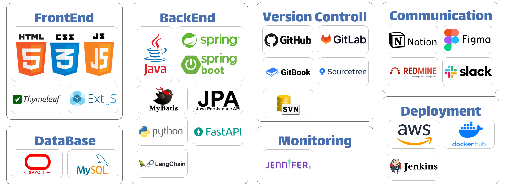

<!-- About Me -->
<H1>:man_technologist: About Me</H1>

<strong>대체 불가능한 개발자</strong>가 되고 싶은 '정현수' 입니다.

Java와 Spring 기반의 3년차 웹 개발자로, 대형 커머스 기업들의 프로젝트와 운영 업무를 통해 실무 경험을 쌓았습니다. 개발 과정에서 자주 쓰는 코드만 쓰는 것을 느꼈고, 이를 극복하기 위해 평소에도 공부하는 개발자가 되기 위해 노력하고 있습니다.

최근에는 인공지능(AI-X) 프로젝트 부트캠프에 참여하여 최신 기술 트렌드를 습득했습니다. 이를 통해 기존의 웹 개발 지식을 AI 분야로 확장하고 있습니다.

<!-- Experience -->
<H1>:briefcase: Experience</H1>  
<H3>(주)커머스웨어</H3> 

<strong>홈쇼핑 전문 솔루션 및 이커머스 솔루션 보유 기업</strong>

근무 기간 : 2021.12 ~ 2024.05

고객사 내 프로젝트 개발 및 운영 업무 담당

<ul>
  <li><a href="https://hsjung.gitbook.io/pr/undefined/project/cw/w">W쇼핑 제휴 입점 프로젝트</a></li>
  <li><a href="https://hsjung.gitbook.io/pr/undefined/project/cw/tv-11">신세계TV라이브쇼핑 11번가 입점 상품 동기화 개선 프로젝트</a></li>
  <li><a href="https://hsjung.gitbook.io/pr/undefined/project/cw/sk">SK스토아 TV API팀 운영 업무</a></li>
</ul>

<!-- Skills -->
<H1>:hammer_and_wrench: Skills</H1>

<!-- Education -->
<H1>:mortar_board: Education</H1>
<H3>인공지능(AI-X) 프로젝트 부트캠프</H3>

교육 기간 : 2024.07.04 ~ 2024.08.28

교육 기관 : 하이미디어아카데미

프로젝트 : 

<ul>
  <li><a href="https://hsjung.gitbook.io/pr/undefined/project/hi/undefined">외국인 한국살이 도우미 챗봇</a></li>
  <li><a href="https://hsjung.gitbook.io/pr/undefined/project/hi/ai">토익 스피킹 AI 학습 도우미</a></li>
</ul>
 
<H3>자바 기반 안드로이드 앱 개발</H3>

교육 기간 : 2021.05.06 ~ 2021.10.25

교육 기관 : 더조은컴퓨터아카데미

프로젝트 : 

<ul>
  <li><a href="https://hsjung.gitbook.io/pr/undefined/project/tj/crm">CRM 프로그램</a></li>
  <li><a href="https://hsjung.gitbook.io/pr/undefined/project/tj/undefined">개발자 특화 취업포털사이트</a></li>
</ul>
 
<H3>자바 프로그래밍 기초</H3>

교육 기간 : 2021.02.01 ~ 2021.03.12

교육 기관 : 더조은컴퓨터아카데미

<!-- License -->
<H1>:scroll: License</H1>
<H3>정보처리기사</H3>

취득일자 : 2022.09.02

<H3>컴퓨터활용능력 2급</H3>

취득일자 : 2019.02.01

<!-- Archive -->
<H1>:package: Archive</H1>

<strong>GitBook</strong> : https://hsjung.gitbook.io

<strong>Blog</strong> : https://hyunsus.tistory.com

